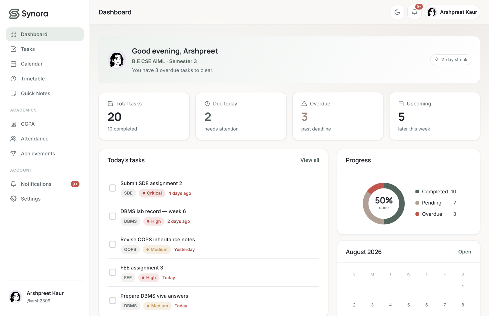

<div align="center">

# ✦ SYNORA ✦

### *One calm home for everything you're studying.*

<p align="center">
  <a href="#-what-is-synora">What is Synora?</a> •
  <a href="#-feature-highlights">Features</a> •
  <a href="#-pages--sections">Pages</a> •
  <a href="#-how-it-works">How It Works</a> •
  <a href="#-tech-stack">Tech Stack</a> •
  <a href="#-design-philosophy">Design</a> •
  <a href="#-getting-started">Getting Started</a>
</p>

[](https://developer.mozilla.org/en-US/docs/Web/HTML)
[](https://developer.mozilla.org/en-US/docs/Web/CSS)
[](https://developer.mozilla.org/en-US/docs/Web/JavaScript)
[](#-privacy--data)
[](#-responsive-design)
[](#-design-philosophy)

<br />

**Synora** is a calm, distraction-free student workspace that unifies tasks, timetables, quick notes, attendance calculations, CGPA estimation, and achievement tracking into a single client-side dashboard.

</div>

---

## ✦ What is Synora?

Academic life is often scattered across fragmented tools: assignment deadlines lost in chat groups, attendance percentages scribbled in notebooks, grades tracked on buried spreadsheets, and timetables saved as gallery screenshots. When key academic details are separated, deadlines become Thursday night surprises and attendance drops below mandatory cut-offs before anyone notices.

**Synora eliminates this fragmentation.** It provides one quiet, cohesive environment designed specifically for students. By bringing essential academic metrics into a single dashboard, Synora answers the question *"What do I need to focus on today?"* in one glance—without advertisements, subscriptions, server telemetry, or unnecessary visual noise.

```
       ┌─────────────────────────────────────────────────────────┐
       │                         SYNORA                          │
       │                   The Calm Workspace                    │
       └────────────────────────────┬────────────────────────────┘
                                    │
    ┌──────────────┬────────────────┼───────────────┬────────────┐
    ▼              ▼                ▼               ▼            ▼
┌─────────┐  ┌───────────┐    ┌───────────┐   ┌───────────┐  ┌───────────┐
│  Tasks  │  │ Timetable │    │   Notes   │   │Attendance │  │   CGPA    │
│ & Dates │  │& Calendar │    │ & Archive │   │Calculator │  │Estimator  │
└─────────┘  └───────────┘    └───────────┘   └───────────┘  └───────────┘
```

---

## ✦ Feature Highlights

| Module | Core Capability | Key Detail |
| :--- | :--- | :--- |
| 📋 **Tasks & Assignments** | Priority-ranked assignment tracking | Dynamic date categorisation (Overdue, Due Today, Upcoming), 4 priority levels, completion tracking. |
| 📅 **Calendar & Timetable** | Dual-view academic scheduling | 7-day weekly schedule grid with room/instructor metadata alongside a monthly deadline overview. |
| 📝 **Quick Notes** | Subject-organized knowledge archive | Instant search-as-you-type, clean text cards, and subject-specific filtering for quick lecture capture. |
| 🎓 **CGPA Calculator** | Credit-weighted grade calculation | Comprehensive 10-point scale supporting distinct academic failure states (`E1`, `E2`, `E3`). |
| 📊 **Attendance Tracker** | Real-time threshold calculation | Dynamic calculation of exact classes you can safely miss or consecutive classes required to reach targets. |
| 🏆 **Achievements** | Motivation & consistency badges | System-awarded milestones for finishing assignments early, keeping streaks, and planning schedules. |
| 🔔 **Notification Centre** | Unified academic alerts | Aggregated alerts for pending deadlines, attendance warnings, and unlocked milestone badges. |
| 🌓 **Adaptive Theme Engine** | Light & Charcoal Dark modes | Persistent theme switching powered by semantic CSS custom properties with zero flash on load. |

---

### 📋 Tasks & Assignments
* **Granular Task Control:** Add, edit, delete, and complete assignments with titles, subject links, priorities (*Critical, High, Medium, Low*), and statuses (*Not started, In progress, Completed*).
* **Automated Date Derivation:** Tasks are dynamically grouped into *All, Today, Upcoming, Overdue,* and *Completed* based on live system dates rather than static manual flags.
* **Search & Sort:** Instantly search through assignments and sort by deadline or urgency.

### 📅 Calendar & Timetable
* **Weekly Class Schedule:** A 7-day Monday–Sunday matrix showing class timings, subjects, instructors, and room numbers. Reflows into collapsible day cards on mobile screens.
* **Monthly Deadline Calendar:** Visual overview showing all assignment deadlines mapped directly onto their calendar dates. Clicking any date reveals active items or opens a quick task creation dialog.

### 📝 Quick Notes
* **Frictionless Note Capture:** Fast, lightweight capture of formulas, study checklists, and lecture takeaways.
* **Subject Tagging & Search:** Notes are organized by subject and filterable through a live search bar.

### 🎓 CGPA Calculator
* **10-Point Academic Scale:** Accurately computes weighted CGPA using credits assigned to each subject:
  $$\text{CGPA} = \frac{\sum (\text{Credits} \times \text{Grade Point})}{\sum \text{Credits}}$$
* **Dedicated Failure States:** Uniquely models distinct exam outcomes without merging them:
  * `O` (10), `A+` (9), `A` (8), `B+` (7), `B` (6)
  * `E1` (Failed in Internals · 0 pts)
  * `E2` (Failed in End Term Exam · 0 pts)
  * `E3` (Failed in Both Internals & End Term · 0 pts)
* **Split Bar Visualisation:** High-contrast split bar chart displaying passing grades ascending above the baseline and backlog failure states descending below zero.

### 📊 Attendance Calculator
* **One-Touch Adjustments:** Incremental `+` and `−` controls for held and attended sessions.
* **Actionable Guidance:** Computes whether you are above or below your target percentage (e.g., 75%) and displays exact math:
  * *Classes you can safely miss while remaining above target.*
  * *Consecutive classes you must attend to recover your attendance.*
* **Selective Subject Tracking:** Non-attendance subjects (such as audits or electives) can be excluded from attendance warnings while remaining part of the CGPA calculation.

### 🏆 Achievements & Streaks
* **Behavior-Based Milestones:** Badges unlock automatically as you use the workspace—such as creating your first note, maintaining a study streak, completing multiple tasks, or setting up a full timetable.

---

## ✦ Pages & Sections

```
Synora/
├── index.html                 # Public marketing landing page & feature showcase
├── notes.html                 # Standalone offline study & viva guide (zero dependencies)
│
├── app/                       # Core client-side application suite
│   ├── login.html             # Account sign-in & demo account access
│   ├── signup.html            # User registration (client-side)
│   ├── onboarding.html        # 6-step workspace personalization wizard
│   ├── dashboard.html         # Central command center & academic snapshot
│   ├── tasks.html             # Task management & deadline tracking
│   ├── calendar.html          # Monthly deadline calendar view
│   ├── timetable.html         # Weekly 7-day class schedule
│   ├── notes.html             # Subject-categorized study notes
│   ├── attendance.html        # Attendance calculator & threshold analysis
│   ├── cgpa.html              # Credit-weighted CGPA estimator & grade chart
│   ├── achievements.html      # Milestone badges & streak statistics
│   ├── notifications.html     # Aggregated alerts & academic warnings
│   └── settings.html          # Profile, avatar, subject catalog, & preferences
```

---

## ✦ How It Works

Synora takes you from a blank slate to a structured academic routine in three clear steps:

```
    ┌─────────────────────────┐
    │ 1. Create Your Account  │ ──► Enter your name, username, email & password
    └───────────┬─────────────┘
                │
    ┌───────────▼─────────────┐
    │ 2. Make Synora Yours    │ ──► Choose avatar, configure subjects & attendance target
    └───────────┬─────────────┘
                │
    ┌───────────▼─────────────┐
    │ 3. Start With Clarity   │ ──► Open your unified dashboard with all tools linked
    └─────────────────────────┘
```

1. **Create Your Account:** Register with your name, username, email, and password. Synora creates a dedicated local workspace partition directly inside your browser.
2. **Make Synora Yours:** Step through an onboarding flow to pick an illustrated avatar or initials color, set your academic program and semester, define your subjects with credit weightings, and set your target attendance percentage.
3. **Start With a Clear Week:** Your dashboard opens with subjects already interconnected. Timetable entries, grade sheets, attendance monitors, and task forms read from the same subject catalog.

---

## ✦ Tech Stack

Built deliberately without heavyweight frameworks, complex bundlers, or third-party tracking scripts.

```
┌───────────────────────────────────────────────────────────────────────────┐
│                                TECH STACK                                 │
├───────────────────┬───────────────────────────────────────────────────────┤
│ Structure         │ HTML5 (Semantic landmarks, native <details> FAQ)      │
│ Styling           │ CSS3 (Custom properties / Tokens, Grid, Flexbox)      │
│ Interactivity     │ Vanilla JavaScript (ES6+, DOM APIs, Date/Intl engine) │
│ Persistence       │ Client-side LocalStorage (Namespaced JSON store)      │
│ Typography        │ Google Fonts (Inter & Manrope with system fallbacks)  │
│ Asset Format      │ Vector SVGs & optimized PNG brand lockups             │
└───────────────────┴───────────────────────────────────────────────────────┘
```

* **Zero Dependencies:** No `node_modules`, no runtime bundlers, no external JavaScript frameworks.
* **CSS Custom Properties:** Complete design token architecture (`tokens.css`) defining typography, spacing, elevations, and dual-theme palettes.
* **Accessible Component Architecture:** Native disclosure widgets for FAQ accordions, semantic form controls, skip-to-content links, and keyboard-trapped modal dialogs.
* **Pre-paint Theme Script:** `scripts/theme.js` executes in the `<head>` to prevent any flash of unstyled theme during page initialization.

---

## ✦ Design Philosophy

```
  ┌──────────────────┐    ┌──────────────────┐    ┌──────────────────┐
  │  Calm by Design  │    │  Privacy First   │    │ Unified Context  │
  │ Minimalist focus │    │ On-device data   │    │ Single source of │
  │ & reduced noise  │    │ & zero telemetry │    │ academic truth   │
  └──────────────────┘    └──────────────────┘    └──────────────────┘
```

### 🌿 Calm by Design
Academic tools often add stress through red warning badges, intrusive pop-ups, and cluttered sidebars. Synora uses subdued tones, generous whitespace, clear typography, and structured grids to keep attention on your coursework.

### 🔒 Privacy First
Your academic life belongs to you. Synora stores accounts, tasks, grades, and notes exclusively within your browser's local sandbox. No data leaves your machine, no cookies track your activity, and no remote server holds your academic history.

### 🏛️ Unified Academic Context
Instead of forcing you to type the same subject names into four different utilities, Synora treats your **Subject List** as the canonical single source of truth. Renaming a subject in Settings instantly updates the Timetable, Attendance cards, and CGPA calculations across the entire application.

### 🎨 Semantic Design Tokens

| Token Name | Light Hex | Dark Hex | Application Role |
| :--- | :--- | :--- | :--- |
| `--ink` | `#22252B` | `#F3F4F6` | Primary headers, high-emphasis text, strong surfaces |
| `--sage` | `#53655C` | `#7C9285` | Primary brand accent, action buttons, active navigation |
| `--slate` | `#A3AEB1` | `#8A9699` | Subdued labels, structural icons, secondary elements |
| `--mist` | `#E5E8EB` | `#2E333D` | Borders, subtle dividers, inactive control outlines |
| `--taupe` | `#B09F95` | `#C4B5AC` | Warm accents, badges, highlights, note card accents |

---

## ✦ User Experience & Interface

```
[ Splash Reveal ] ──► [ Centered Navbar ] ──► [ Interactive Hero ] ──► [ Feature Showcase ]
       │                      │                         │                      │
   2000ms / 600ms       3-Track Centered          Live Task Preview      Card Grid & Stats
   Motion Handover      Brand & Quick Nav         Streak Badges          & Real Screenshot
```

* **Staggered Splash Screen:** A CSS/SVG loading badge with a rotating gradient aura and sweeping wordmark sheen welcomes the user for 2000ms (or 600ms when `prefers-reduced-motion` is active) before smoothly handing over to the page content.
* **Balanced 3-Track Navigation:** A CSS Grid header (`minmax(0, 1fr) auto minmax(0, 1fr)`) ensures centered links while actions and branding align symmetrically on the sides.
* **CSS-Only Mobile Navigation:** Below 900px, navigation links reflow cleanly into a slide-down mobile panel controlled through an accessible, zero-JavaScript checkbox toggle.
* **Non-Blocking Feedback:** In-app operations use subtle toast alerts and inline field validation rather than disruptive browser dialogs.

---

## ✦ Privacy & Data Architecture

Synora operates on a transparent, purely client-side data model powered by standard browser `localStorage`.

```
localStorage
├── synora-users                          # Registered account registry
├── synora-session                        # Active session username
├── synora-theme                          # User theme preference ("light" | "dark")
│
└── synora:<username>:*                   # Isolated per-user data partition
    ├── profile                           # Name, program, semester, avatar, attendance target
    ├── subjects                          # Canonical list of subjects & credit allocations
    ├── tasks                             # Task records, priorities, deadlines, status
    ├── notes                             # Categorized study notes
    ├── timetable                         # Weekly schedule entries with time/room data
    ├── attendance                        # Held and attended session counts
    ├── cgpa                              # Subject grade records
    ├── achievements                      # Timestamped unlocked achievement IDs
    ├── notifications                     # Alert history & read/unread state
    └── meta                              # Study streaks & last completion timestamps
```

### Architectural Notes & Invariants
* **Isolated Multi-User Support:** User data is segregated by username keys (`synora:<username>:<collection>`). Multiple students can use the same browser without their records mixing.
* **Derived State:** Percentages, CGPA totals, deadline statuses (Overdue/Due Today), and streak counts are **derived at runtime** rather than stored as static values.
* **Trade-off Notice:** Because data lives strictly on-device, clearing your browser's site data will reset your workspace. Data does not synchronize across separate physical devices.

---

## ✦ Preview

```
┌────────────────────────────────────────────────────────────────────────┐
│  SYNORA DASHBOARD                                        [Light | Dark]│
├────────────────────────────────────────────────────────────────────────┤
│  Good morning, Manan · B.E CSE AIML (Semester 3)                       │
│                                                                        │
│  [ Total: 12 ]   [ Due Today: 2 ]   [ Overdue: 0 ]   [ Upcoming: 5 ]   │
│                                                                        │
│  ┌─────────────────────────┐  ┌─────────────────────────────────────┐  │
│  │ Today's Schedule        │  │ Today's Tasks                       │  │
│  │ 09:00 - DBMS (Room 302) │  │ [ ] Submit Networks Assignment (6pm)│  │
│  │ 11:00 - SDE Lab         │  │ [x] Read Operating Systems Ch. 4    │  │
│  └─────────────────────────┘  └─────────────────────────────────────┘  │
│                                                                        │
│  ┌─────────────────────────┐  ┌─────────────────────────────────────┐  │
│  │ Attendance: 84.5%       │  │ CGPA Snapshot: 8.75 / 10.0          │  │
│  │ (Target: 75% · +3 Safe) │  │ (6 Graded Subjects · All Clear)     │  │
│  └─────────────────────────┘  └─────────────────────────────────────┘  │
└────────────────────────────────────────────────────────────────────────┘
```

<div align="center">



*A view of the Synora Dashboard showcasing the greeting, statistics, daily agenda, calendar, and academic overview.*

</div>

---

## ✦ Project Structure

```text
Synora/
├── index.html                 # Marketing landing page & feature overview
├── notes.html                 # Standalone study & viva reference guide
├── README.md                  # Project documentation & reference
│
├── app/                       # Application Views
│   ├── login.html             # Sign-in form with demo account shortcut
│   ├── signup.html            # Registration form
│   ├── onboarding.html        # Multi-step setup wizard
│   ├── dashboard.html         # Main dashboard summary
│   ├── tasks.html             # Task creation & filtering interface
│   ├── calendar.html          # Deadline calendar view
│   ├── timetable.html         # Weekly schedule grid
│   ├── notes.html             # Quick notes archive
│   ├── attendance.html        # Attendance calculator & warning monitor
│   ├── cgpa.html              # CGPA calculator & grade visualizer
│   ├── achievements.html      # Gamified achievements & milestone grid
│   ├── notifications.html     # Alert centre
│   └── settings.html          # Profile settings, avatar selector, & subjects
│
├── styles/                    # Modular Style Sheets
│   ├── tokens.css             # Design tokens: typography, colors, shadows, radii
│   ├── base.css               # Global CSS reset & base typography rules
│   ├── components.css         # Reusable UI primitives (buttons, inputs, cards, dialogs)
│   ├── landing.css            # Landing page layout, animations, splash loader
│   ├── app.css                # Application shell, sidebar, topbar, & view styles
│   ├── auth.css               # Authentication layouts for sign-in and sign-up
│   └── onboarding.css         # Step-by-step onboarding wizard layout
│
├── scripts/                   # Modular Application Logic
│   ├── theme.js               # Fast pre-paint theme initialiser
│   ├── storage.js             # Data layer: CRUD operations & LocalStorage manager
│   ├── avatars.js             # Vector avatar definitions & initials generator
│   ├── demo-data.js           # Sample workspace fixture for demonstrations
│   ├── auth.js                # Sign-in, registration, & session controllers
│   ├── onboarding.js          # Onboarding step logic & state management
│   ├── contact.js             # Landing page contact validation & info bindings
│   ├── app.js                 # App shell: navigation, modal engines, notifications
│   ├── dashboard.js           # Dashboard metrics & schedule aggregator
│   ├── tasks.js               # Task CRUD & dynamic filter engine
│   ├── calendar.js            # Monthly grid rendering & deadline mapping
│   ├── timetable.js           # Weekly timetable matrix generator
│   ├── notes.js               # Notes manager & live filter engine
│   ├── attendance.js          # Attendance math & recovery calculation
│   ├── cgpa.js                # Grade mapping & split-bar chart renderer
│   ├── achievements.js        # Milestone verification & badge engine
│   ├── notifications.js       # Alert builder & read status handlers
│   └── settings.js            # Subject management, profile, & target updates
│
└── assets/                    # Static Assets
    ├── favicon.svg            # Scalable SVG brand favicon
    ├── favicon-32.png         # 32x32 PNG favicon
    ├── favicon-180.png        # 180x180 Apple touch icon
    ├── logo-lockup-light.png  # Brand mark + wordmark (Light background)
    ├── logo-lockup-dark.png   # Brand mark + wordmark (Dark background)
    ├── logo-mark-light.png    # Monogram logo mark (Light background)
    ├── logo-mark-dark.png     # Monogram logo mark (Dark background)
    ├── logo-stacked-light.png # Stacked logo lockup (Light background)
    ├── logo-stacked-dark.png  # Stacked logo lockup (Dark background)
    ├── avatars/               # 12 curated vector avatars (Lorelei style, CC0)
    ├── img/                   # Editorial workspace imagery for landing page
    └── preview/               # Application preview screenshot (dashboard.png)
```

---

## ✦ Getting Started

Because Synora is built entirely with standard web technologies, there are no compilers or package installations required.

### 1. Clone the Repository
```bash
git clone https://github.com/YOUR-USERNAME/Synora.git
```

### 2. Enter the Directory
```bash
cd Synora
```

### 3. Run a Local Development Server
To allow modular relative paths and `localStorage` persistence across all views, serve the project via a local HTTP server:

**Using Python 3:**
```bash
python -m http.server 8000
```

**Using Node (`npx`):**
```bash
npx serve .
```

**Using VS Code:**
Install the **Live Server** extension, right-click `index.html`, and select **"Open with Live Server"**.

### 4. Open in Your Browser
Navigate to `http://localhost:8000` in any modern web browser.

> **Testing Options:**
> * **New Student Journey:** Click **"Create account"**, complete the quick registration, and customize your workspace via the onboarding wizard.
> * **Instant Demonstration:** Go to **Sign In** and click **"Use the demo account"** to immediately explore a populated workspace with realistic semester data.

---

## ✦ Responsive Design

Synora is built to deliver a seamless experience across all device form factors:

* **Desktop Workspaces (≥ 1024px):** Displays a persistent sidebar, multi-column dashboard widgets, and a full 7-day horizontal timetable grid.
* **Tablets & Small Laptops (768px – 1023px):** Fluid grid reflows with condensed calendar cells and responsive summary cards.
* **Mobile Devices (< 768px):** Navigation transitions into an off-canvas drawer with a touch-friendly toggle. The weekly timetable reflows from a horizontal grid into day-by-day stacked schedule cards.

---

## ✦ Accessibility

Synora incorporates accessible web practices to ensure an inclusive user experience:

* **Semantic Landmark Structure:** Proper use of `<header>`, `<nav>`, `<main>`, `<section>`, `<article>`, and `<footer>` elements.
* **Direct Navigation:** Includes a visible `#main` **Skip to content** link for keyboard users.
* **Form Accessibility:** All form inputs have explicitly associated `<label>` elements and inline error message regions.
* **High Contrast Ratios:** All text and UI component color tokens meet standard contrast thresholds across both light and dark themes.
* **Reduced Motion Compliance:** Full support for `prefers-reduced-motion: reduce`, disabling animations and shortening loader durations for users who prefer minimal motion.
* **Keyboard-Friendly Interactions:** Modal dialogues, drawers, and interactive cards support standard keyboard focus and `Escape` key dismissal.

---

## ✦ FAQ

#### Is Synora completely free?
Yes. Synora has no paid tiers, no premium locked features, no trial periods, and no advertisements.

#### Do I need to create an account?
Yes. Synora uses client-side account records to isolate tasks, timetables, and grades for individual users sharing the same browser. Creating an account takes less than a minute.

#### Where is my academic data saved?
All data is stored directly in your browser's `localStorage` on your local device. Nothing is uploaded to any remote server or third-party service.

#### Does Synora work on mobile browsers?
Yes. Synora is fully responsive and runs smoothly in modern mobile browsers on both iOS and Android.

---

## ✦ Contact

The landing page includes a **Contact Us** section featuring contact information and a **Get in Touch** form with fields for:

* Full Name
* Email Address
* Phone Number
* Message text

The form features instantaneous client-side validation through `scripts/contact.js`. Contact display values can be customized in the `CONTACT_INFO` configuration object in `scripts/contact.js`:

```javascript
var CONTACT_INFO = {
  phone: "+91 00000 00000",
  email: "hello@synora.example",
  office: "Add your campus or office address",
  mapUrl: "" // Displays "View location" link when populated
};
```

---

## ✦ Project Goals

* **Eliminate Academic Fragmentation:** Bring disparate study tools into a single, cohesive interface.
* **Foster Calm & Focus:** Replace high-stress notification feeds with a clean, actionable daily agenda.
* **Simplify Complex Calculations:** Automate credit-weighted CGPA estimation and attendance safe-miss thresholds.
* **Protect Student Privacy:** Maintain an entirely client-side workspace model with zero data tracking.
* **Deliver Dependable Performance:** Provide an ultra-fast web experience with zero heavy framework overhead.

---

## ✦ The Team

Built as a student project with a focus on simplicity, productivity, and thoughtful web design.

---

## ✦ Potential Future Improvements

> **Note:** The items below represent prospective architectural enhancements and ideas for future exploration.

* [ ] **Optional Cloud Sync:** Encrypted cloud backup for syncing workspaces across multiple devices.
* [ ] **Calendar Export:** Exporting class timetables and assignment deadlines to standard `.ics` format.
* [ ] **Syllabus & Course Checklist:** Topic-by-topic tracking within each registered subject.
* [ ] **Backend Service Integration:** Real-time email dispatch integration for the Get in Touch contact endpoint.
* [ ] **Push Reminders:** Configurable browser web push notifications for upcoming high-priority assignments.

---

<div align="center">

*Made with care for student productivity and calm learning.*

**Synora** — *Organize · Focus · Progress*

</div>
